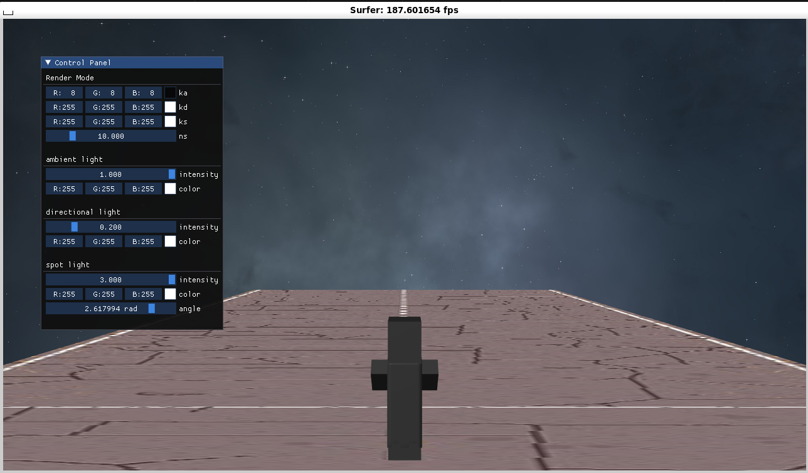
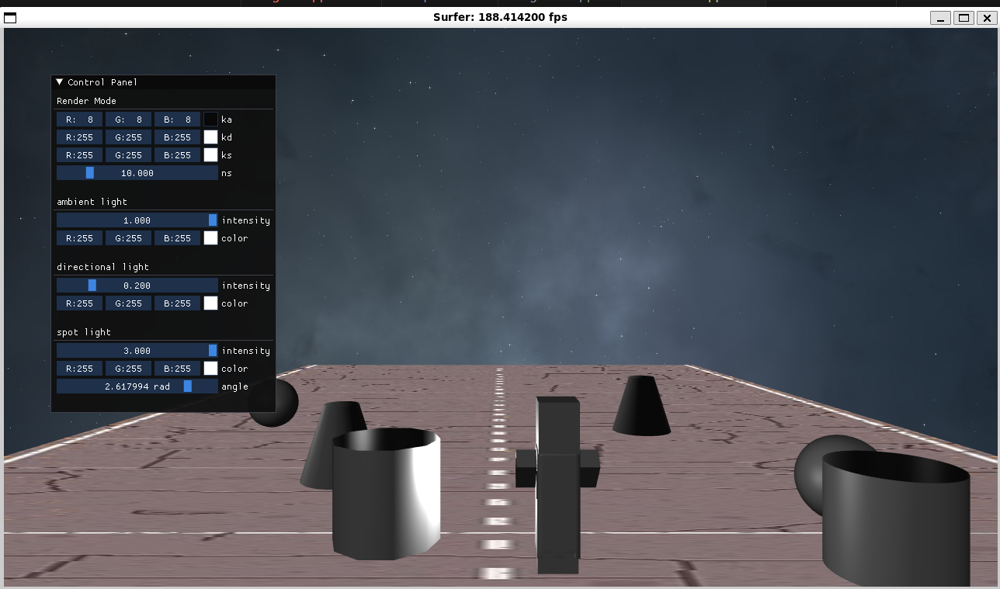
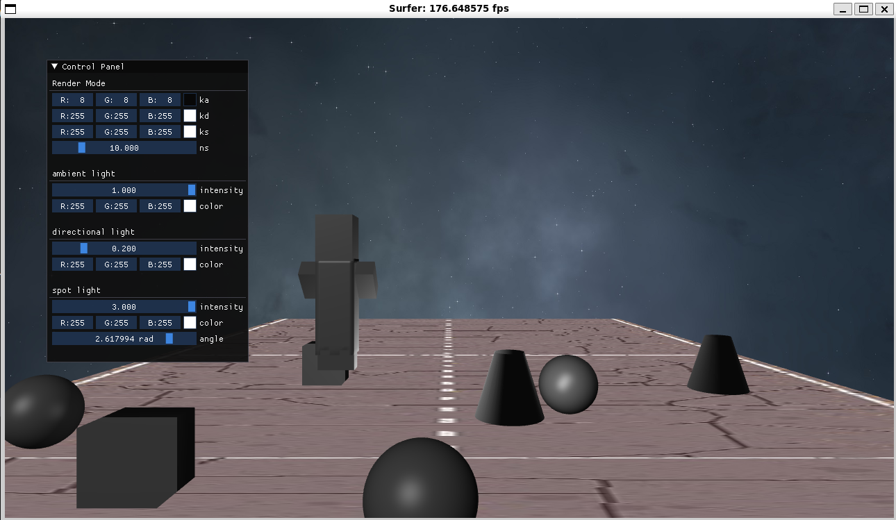
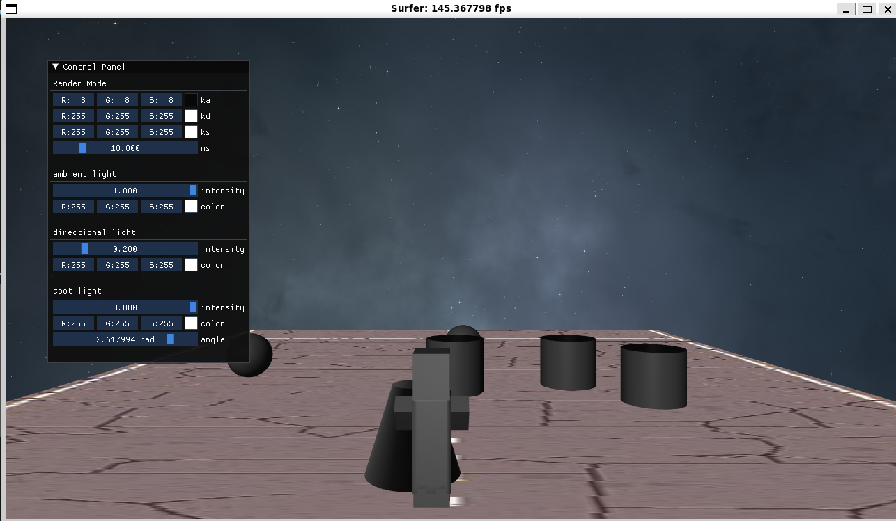

# 系统设计说明文档

小组成员：周健，郭永军，郭昊


## 一、程序操作说明
### 编译
在linux平台下进行,由于使用了random device，无法在windows下编译。
```
mkdir build;
cd build;
cmake ..;
make;
cd bin/Debug(Release)
./surfer
```
### 操作
本程序为操纵任务躲避障碍物的小游戏，地图中会自动生成各种基本体素（立方体，球，圆柱等）形状的障碍物。
1. 玩家可以通过A,S键控制人物左右移动进行躲避，也可以通过空格键跳跃躲避，并且可以用W键加速前进。
2. S键可以暂停，再按S键开始。
3. 当碰到障碍物时游戏结束，按R键可以重新开始。
4. 鼠标滚轮可以操控视角大小，按F键自动恢复初始大小。
5. 玩家自带一个聚光灯，可以调节光线的角度，亮度等等。地面亮度由环境光决定。









## 二、原理

本实验通过使用OpenGL库和C++编程语言实现了一个简单的躲避障碍物的游戏。

1. 窗口和OpenGL环境初始化：首先，我们创建一个窗口，并使用OpenGL初始化3D图形环境。这会提供一个虚拟的3D空间，供我们在其中渲染障碍物和角色。
2. 障碍物和角色模型加载：我们加载障碍物和角色的3D模型，包括顶点信息、纹理坐标和法线向量。
3. 游戏逻辑实现：我们实现了基本的游戏逻辑，包括障碍物的生成和移动，角色的控制，碰撞检测等。玩家可以使用键盘控制角色的移动，同时游戏会不断随机生成障碍物，玩家需要躲避这些障碍物。
4. 摄像机控制：我们实现了摄像机的控制，以便跟踪角色并呈现合适的视角。这涉及到摄像机位置和方向的计算，并在渲染循环中更新。
5. 渲染循环：我们使用一个无限循环来持续渲染游戏场景，同时更新障碍物和角色的位置。这确保了游戏画面的流畅性，并提供了实时的交互体验。
6. 结束和资源释放：当游戏结束时，我们会释放所使用的资源，包括删除模型、纹理和其他OpenGL对象。这有助于避免内存泄漏和资源浪费。

## 三、程序实现

我们的程序实现了以下要求：

##### 1.具有基本体素的建模表达能力

在本程序中，我们生成了不同体素的障碍物。这是通过随机函数实现的，首先随机选择障碍物的类型，再随机在前进的路面上选择障碍物的位置和大小等。


##### 2.具有基本三维网络导入导出功能

我们修改了model类，添加了`Model(const std::string& filename,bool myloader);
    bool exportToOBJ(const std::string& filename);`

当测试开启时，我们首先将人物模型用tinyobj导入，再用我们自己实现的功能导出到elf文件目录下，再将其重新导入。

##### 3.具有基本材质、纹理的显示和编辑能力

在本程序中，我们实现了地板的纹理显示：


##### 4.具有基本的几何变换功能

本程序中我们人物和障碍物的移动实现了平移，障碍物的生成有缩放，人物一开始也进行了旋转。

##### 5.基本光照模型要求，并实现基本的光源编辑

可以通过Imgui对光照进行操作，包括环境光，平行光和一个聚光灯。

##### 6.能对建模后场景进行漫游如Zoom In/Out等观察功能

通过鼠标滚轮即可改变，按F键即可回到合适视角，这是通过改变摄像机投影矩阵的foxy实现的。

##### 7.漫游时可实时碰撞检测

本程序中对不同的障碍物之间、人物与障碍物之间都进行了碰撞检测，前者保证障碍物生成时不会重叠，后者用来判断游戏是否结束。

若障碍物是长方体，我们用简单的AABB碰撞检测，判断三个维度是否都有重叠即可；若为球体，则先找出人物模型里球体最近的点，这可以通过一个简单的clamp函数实现，再判断最近的点到球中心的距离是否小于半径来判断。

##### 8.构建了完整的三维游戏，具有可玩性

本程序即为一个人物不断躲避出现的障碍物的游戏，具备一定的可玩性。


